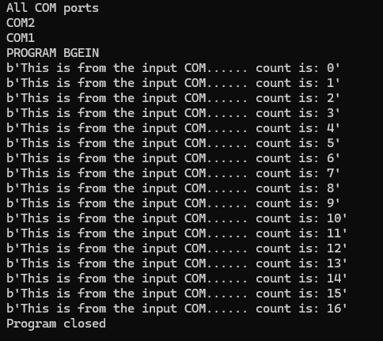
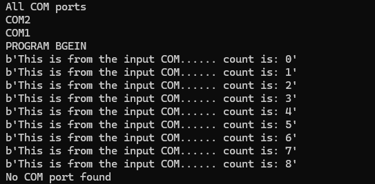

# This project was made for as an Upwork submission requirement

This is the readme file, I will try an explain how this works form here
This program simply runs by writing to COM 1 and reading what was writing to COM 1 from COM 2

# To begin


``` bash
pip install requirements.txt
```


# Then run
```bash
py main.py
```


# Sample output

For my virtual port emulator, I used [Virtual Serial Port Driver](https://www.virtual-serial-port.org/), where I created a pair between COM 1 and COM 2

Here are the screenshots showing the project working




And here is a screenshot showing when the COM port is disconected


And here is a screenshot showhing when the COM port is disconected while the program is still running

